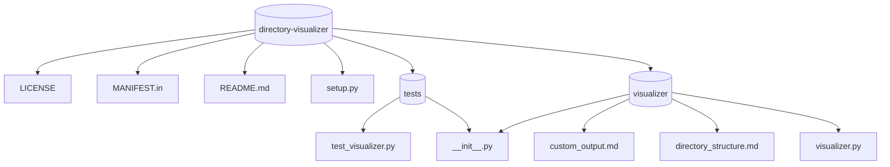

# Directory Visualizer

A simple CLI tool to visualize directory structures as Markdown or Mermaid diagrams. This tool can help you quickly document the folder structure of any directory in a human-readable format or generate a Mermaid diagram for visual representation.

## Features

- **Directory Structure Visualization**: Create an easily readable Markdown file that represents the directory structure.
- **Mermaid Diagram Generation**: Generate a Mermaid diagram to visualize the directory structure as a flowchart.
- **CLI Tool**: Run the tool from the command line with various options for customization, such as setting the depth of traversal or choosing the output format.

## Installation

To install **directory-visualizer**, you can use pip:

```bash
pip install directory-visualizer
```

## Usage

Once installed, you can use the command line interface (CLI) to visualize any directory.

### Basic Command

To generate a directory structure in **Markdown** format:

```bash
directory-visualizer -p <path_to_directory> -f markdown
```

This will create a `directory_structure.md` file in the current working directory.

### Generate Mermaid Diagram

To generate a **Mermaid diagram** (embedded in Markdown):

```bash
directory-visualizer -p <path_to_directory> -f mermaid
```

This will create a `directory_structure.md` file with the Mermaid diagram.

### Generate Raw Mermaid File

If you prefer to save the diagram as a raw `.mmd` file, use the `--raw-mermaid` flag:

```bash
directory-visualizer -p <path_to_directory> -f mermaid --raw-mermaid
```

This will create a `directory_structure.mmd` file that can be rendered using Mermaid live editors or other Mermaid-supported tools.

### Set Directory Traversal Depth

You can limit the depth of directory traversal using the `--depth` option. For example, to visualize only the first two levels of a directory structure:

```bash
directory-visualizer -p <path_to_directory> -f markdown --depth 2
```

### Output to Specific File

Use the `-o` option to specify a custom output file name:

```bash
directory-visualizer -p <path_to_directory> -f markdown -o custom_output.md
```

### Example

To visualize the directory structure of `E:\files\Directory_Visualizer\directory-visualizer` in **Markdown** format with a depth of 3:

```bash
directory-visualizer -p E:\files\Directory_Visualizer\directory-visualizer -f markdown --depth 3
```

This will generate a `directory_structure.md` file with the directory structure up to level 3.

## Options

- `-p, --path <directory>`: Path to the directory to visualize.
- `-f, --format <format>`: Output format (`markdown`, `mermaid`). Default is `markdown`.
- `-o, --output <file>`: Output file path to save the visualization.
- `--depth <depth>`: Limit the directory traversal depth.
- `--raw-mermaid`: Save the Mermaid diagram as a raw `.mmd` file (instead of Markdown).
  
## Example Output

### Markdown Example

```markdown
# Directory Structure of E:\files\Directory_Visualizer\directory-visualizer

- # directory-visualizer
  - LICENSE
  - MANIFEST.in
  - README.md
  - setup.py
  - ## tests
    - test_visualizer.py
    - __init__.py
  - ## visualizer
    - custom_output.md
    - directory_structure.md
    - visualizer.py
    - __init__.py
```

### Mermaid Example



## Contributing

If you would like to contribute to this project, please fork the repository, create a new branch, and submit a pull request. All contributions are welcome!

### Steps to Contribute:
1. Fork the repository.
2. Create a new branch: `git checkout -b feature-name`.
3. Make your changes.
4. Commit your changes: `git commit -am 'Add new feature'`.
5. Push to your forked branch: `git push origin feature-name`.
6. Open a pull request.

## License

This project is licensed under the MIT License - see the [LICENSE](LICENSE) file for details.

## Author

**Md. Rasel Meya**

- Email: [rhrasel94@gmail.com](mailto:rhrasel94@gmail.com)
- GitHub: [raselmeya94](https://github.com/raselmeya94)

## Acknowledgements

- Thanks to all the contributors who helped improve this project.
- Special thanks to the open-source community for their valuable contributions.


### Points to Note:
1. **Features section**: Briefly explains what your tool does.
2. **Installation and Usage**: Guides the user on how to install and use the tool with examples of common commands.
3. **Example Output**: Shows what the output looks like for both markdown and mermaid formats.
4. **Contributing**: Instructions for contributing to the project.
5. **License**: Specifies the project's licensing (MIT, in this case).
6. **Acknowledgements**: Recognizes contributors and open-source support.

This README file should provide users with all the necessary information to get started with your **directory-visualizer** project. You can always modify the details as you see fit. Let me know if you'd like any adjustments!