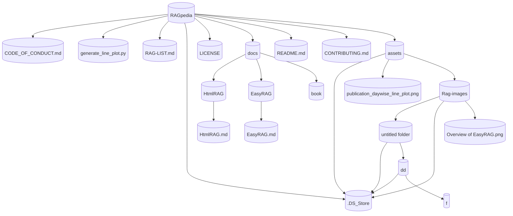

```mermaid
graph TD
  RAGpedia[( RAGpedia )]
    RAGpedia --> CODE_OF_CONDUCT_md[( CODE_OF_CONDUCT.md )]
    RAGpedia --> generate_line_plot_py[( generate_line_plot.py )]
    RAGpedia --> RAG_LIST_md[( RAG-LIST.md )]
    RAGpedia --> _DS_Store[( .DS_Store )]
    RAGpedia --> LICENSE[( LICENSE )]
    RAGpedia --> docs[( docs )]
      docs --> HtmlRAG[( HtmlRAG )]
        HtmlRAG --> HtmlRAG_md[( HtmlRAG.md )]
      docs --> EasyRAG[( EasyRAG )]
        EasyRAG --> EasyRAG_md[( EasyRAG.md )]
      docs --> book[( book )]
    RAGpedia --> README_md[( README.md )]
    RAGpedia --> CONTRIBUTING_md[( CONTRIBUTING.md )]
    RAGpedia --> assets[( assets )]
      assets --> _DS_Store[( .DS_Store )]
      assets --> publication_daywise_line_plot_png[( publication_daywise_line_plot.png )]
      assets --> Rag_images[( Rag-images )]
        Rag_images --> untitled_folder[( untitled folder )]
          untitled_folder --> _DS_Store[( .DS_Store )]
          untitled_folder --> dd[( dd )]
            dd --> _DS_Store[( .DS_Store )]
            dd --> f[( f )]
        Rag_images --> _DS_Store[( .DS_Store )]
        Rag_images --> Overview_of_EasyRAG_png[( Overview of EasyRAG.png )]
```