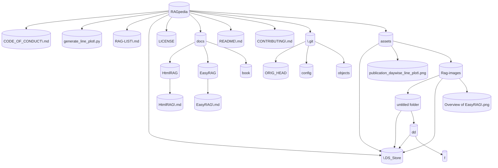

```mermaid
graph TD
  RAGpedia[( RAGpedia )]
    RAGpedia --> CODE_OF_CONDUCT\_md[( CODE_OF_CONDUCT\.md )]
    RAGpedia --> generate_line_plot\_py[( generate_line_plot\.py )]
    RAGpedia --> RAG_LIST\_md[( RAG-LIST\.md )]
    RAGpedia --> \_DS_Store[( \.DS_Store )]
    RAGpedia --> LICENSE[( LICENSE )]
    RAGpedia --> docs[( docs )]
      docs --> HtmlRAG[( HtmlRAG )]
        HtmlRAG --> HtmlRAG\_md[( HtmlRAG\.md )]
      docs --> EasyRAG[( EasyRAG )]
        EasyRAG --> EasyRAG\_md[( EasyRAG\.md )]
      docs --> book[( book )]
    RAGpedia --> README\_md[( README\.md )]
    RAGpedia --> CONTRIBUTING\_md[( CONTRIBUTING\.md )]
    RAGpedia --> \_git[( \.git )]
      \_git --> ORIG_HEAD[( ORIG_HEAD )]
      \_git --> config[( config )]
      \_git --> objects[( objects )]
        
    RAGpedia --> assets[( assets )]
      assets --> \_DS_Store[( \.DS_Store )]
      assets --> publication_daywise_line_plot\_png[( publication_daywise_line_plot\.png )]
      assets --> Rag_images[( Rag-images )]
        Rag_images --> untitled_folder[( untitled folder )]
          untitled_folder --> \_DS_Store[( \.DS_Store )]
          untitled_folder --> dd[( dd )]
            dd --> \_DS_Store[( \.DS_Store )]
            dd --> f[( f )]
        Rag_images --> \_DS_Store[( \.DS_Store )]
        Rag_images --> Overview_of_EasyRAG\_png[( Overview of EasyRAG\.png )]
```